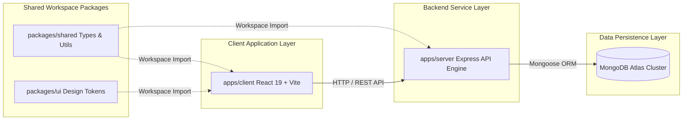
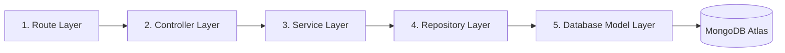
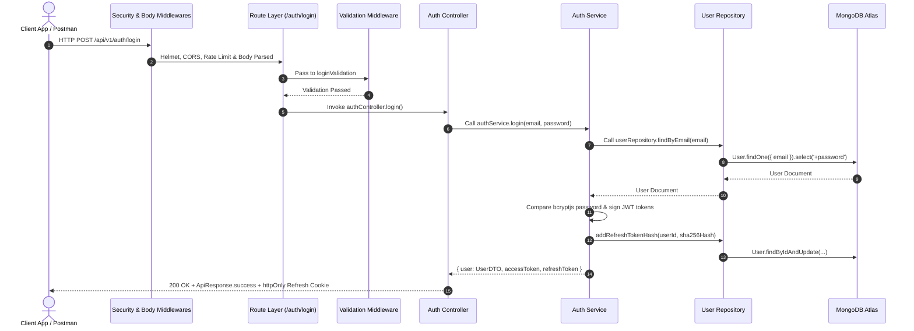

# Developer OS — Architectural Blueprint

**Brand**: Sagar.dev | **Product**: Developer OS  
**Current Release**: `v0.3.0` — Identity Platform Foundation  
**Document Target**: High-level System Architectural Blueprint

---

## 1. System Overview

**Developer OS** is engineered as a decoupled, production-grade monorepo system. The architecture separates the user-facing React 19 client application from the Node.js/Express backend API engine, while enforcing strict TypeScript type contracts, shared constants, and reusable UI design tokens across workspace boundaries.

---

## 2. Monorepo & Workspace Architecture

The repository is managed via `pnpm` workspaces, providing strict package isolation, fast dependency caching, and seamless local cross-package linking.

### Package & Directory Responsibilities:

| Directory | Type | Scope & Responsibility | Detail Guide |
| :--- | :--- | :--- | :--- |
| `apps/client` | App | React 19 SPA, Vite build, Tailwind CSS, TanStack Query. | [Client Architecture Docs](docs/design-system/README.md) |
| `apps/server` | App | Express API Engine, 5-tier architecture, Mongoose connection, JWT Auth. | [Backend Engine Specs](docs/backend/README.md) |
| `packages/shared` | Package | Shared TypeScript interfaces, validation schemas, response envelope types. | [Shared Package Specs](docs/architecture/README.md) |
| `packages/ui` | Package | Developer OS Design Language tokens, CSS variables, atomic UI primitives. | [Design System Specs](docs/design-system/README.md) |
| `configs/` | Config | Shared monorepo build, ESLint, and Prettier configurations. | [Monorepo Setup](docs/releases/v0.1.0-monorepo-foundation.md) |
| `docs/` | Docs | Enterprise documentation hub, architectural specs, and release logs. | [Documentation Hub](docs/README.md) |
| `assets/` | Assets | Visual branding assets, logos, and system architecture diagrams. | [Assets Index](docs/README.md) |

---

## 3. Backend 5-Tier Layered Architecture

The backend (`apps/server`) strictly enforces a **5-tier layered pattern** guaranteeing single responsibility, high testability, and zero leaking of HTTP concerns into business or data access layers.

### Layer Responsibilities:

1. **Route Layer (`src/routes/`)**: URL path mapping, HTTP verb binding, and validation/auth middleware composition. Strictly **zero logic**.
2. **Controller Layer (`src/controllers/`)**: Parses HTTP `req`, handles status codes, serializes responses via `ApiResponse`, manages `httpOnly` cookies. Delegates all work to Services.
3. **Service Layer (`src/services/`)**: Business domain logic, credential validation, token generation, and audit logging. Completely isolated from Express `req`/`res` objects.
4. **Repository Layer (`src/repositories/`)**: Data access abstractions wrapping Mongoose queries. Isolates database technology from business logic.
5. **Database Model Layer (`src/models/`)**: Mongoose schema definitions, field validation constraints, indexes, and JSON serialization transforms.

For deep layer implementation guidelines, view [docs/backend/README.md](docs/backend/README.md).

---

## 4. Request Lifecycle & Execution Sequence

When an API request (e.g. `POST /api/v1/auth/login`) enters Developer OS, it passes through security, validation, and the 5-tier layer stack:

---

## 5. Authentication & Identity Architecture (v0.3.0)

The Identity Platform ([RFC-003](docs/authentication/README.md)) implements a dual-token authentication model:

- **Dual-Token Strategy**:
  - **Access Token**: Short-lived (15m), signed with `JWT_ACCESS_SECRET`, delivered in JSON payload, passed via `Authorization: Bearer <token>` header.
  - **Refresh Token**: Long-lived (7d), signed with `JWT_REFRESH_SECRET`, delivered via secure `httpOnly` cookie (`refreshToken`).
- **Database Token Hashing**: Raw refresh tokens are **never** stored in MongoDB. Only SHA-256 hashes of refresh tokens (`hashToken()`) are persisted in `user.refreshTokens`.
- **Password Security**: Passwords hashed using `bcryptjs` with salt round cost factor 10. `user.model.js` uses `{ select: false }` to prevent password leakage in database queries.
- **DTO Sanitization**: `UserDTO` class extracts safe fields (`id`, `name`, `email`, `role`, `isActive`, `createdAt`), stripping passwords and internal token hashes before API response serialization.
- **Role-Based Access Control (RBAC)**: Declarative role middleware (`authorize(Roles.ADMIN)`) checking role claims against `src/constants/roles.js`.

For complete Identity Platform specifications, view [docs/authentication/README.md](docs/authentication/README.md).

---

## 6. Platform Settings CMS & Maintenance Guard Architecture (v1.1.0)

The Platform Settings CMS ([RFC-007](docs/releases/RFC-007-FINAL-RELEASE-REPORT.md)) implements a singleton domain configuration architecture for system settings and global portfolio state:

- **5-Tier Settings Architecture**:
  - **Model (`settings.model.js`)**: Mongoose schema storing `general`, `hero`, `about`, `socialLinks`, `contactInfo`, `seo`, `footer`, `futureReady`, and `maintenance` configuration blocks with singleton key index (`key: 'site_settings'`).
  - **DTO (`settings.dto.js`)**: Converts MongoDB document to clean payload, hiding sensitive maintenance IP lists or internal timestamps when serializing public endpoints.
  - **Validator (`settings.validator.js`)**: Sanitizes and validates nested configuration updates.
  - **Repository & Service (`settings.repository.js`, `settings.service.js`)**: Encapsulates atomic upserts and provides default initial settings seeding.
  - **Controller & Routes (`settings.controller.js`, `settings.routes.js`)**: Exposes authenticated management endpoints (`GET/PUT /api/v1/settings`) and unauthenticated public endpoints (`GET /api/v1/settings/public`).

- **TanStack Query Cache Sharing**:
  - `usePublicSettings()` hook consumes `GET /api/v1/settings/public` with 5-minute `staleTime` under queryKey `['site-settings']`.
  - Saving settings in Admin CMS triggers `queryClient.invalidateQueries({ queryKey: ['site-settings'] })`, invalidating public cache instantly.

- **System Maintenance Guard Mode (`MaintenanceGuard.jsx`)**:
  - Extensible route wrapper guarding public pages when `settings.maintenance.enabled === true`.
  - Route matcher `isMaintenanceBypassRoute(pathname)` checks `MAINTENANCE_BYPASS_ROUTES = ['/admin']`, guaranteeing uninterrupted admin access.
  - Overrides document title (`Maintenance | Developer OS`) and enforces search engine exclusion (`<meta name="robots" content="noindex, nofollow" />`) during active maintenance cycles.

---

## 7. Engineering Design Principles & ADRs

1. **Single Source of Truth**: Data schemas defined in `packages/shared` and `user.model.js` serve as single authoritative definitions.
2. **Fail Fast Configuration**: `env.config.js` validates all mandatory environment variables on startup and halts boot if keys are missing.
3. **Decoupled App/Server Lifecycle**: `app.js` exports pure Express app instance; `server.js` manages DB boot, server listener, and graceful signal shutdown (`SIGTERM`, `SIGINT`).
4. **Structured Operational Logging**: Winston logger abstraction (`src/config/logger.js`) provides environment-aware JSON formatting in production and colorized output in dev. Audit logs track security events without logging passwords or plain tokens.

For complete Architectural Decision Records, consult [docs/architecture/README.md](docs/architecture/README.md).

---

## 7. Current Implemented Stack vs Future Architecture

### Current Implemented Architecture (`v1.2.0`)
- **Monorepo Topology**: `pnpm` workspaces (`apps/client`, `apps/server`, `packages/shared`, `packages/ui`).
- **Backend Platform**: Decoupled Express engine, 5-tier architecture, Winston logger, security stack, global error handler, health check API (`GET /api/v1/health`).
- **Identity Platform**: User schema, `bcryptjs`, dual JWT tokens, SHA-256 token database storage, `UserDTO`, RBAC, `/api/v1/auth/*` endpoints.
- **Platform Settings CMS & Maintenance Guard**: Singleton settings model, public cache sharing, route guard.
- **AI Integration Layer (RFC-008)**: `@google/genai` Gemini 2.0 Flash integration, 5-tier AI routes (`/api/v1/ai/*`), real-time SSE stream controller, 90-day MongoDB TTL audit log repository (`AILog`), dedicated rate limiter (`aiRateLimiterMiddleware`), client streaming hook (`useAIStream`), slide-out `AIAssistantDrawer`, and Admin AI telemetry dashboard (`AILogsAdmin`).

### Future Architecture Roadmap
- **RFC-004**: Public Portfolio & CMS Database Schemas.
- **RFC-005**: Blog Engine, Tagging System, Markdown AST Renderer.
- **RFC-006**: Cloudinary Media Management & Asset Repository Layer.
- **RFC-007**: Contact Submissions & System Analytics Aggregator.
- **RFC-008**: AI Integration Layer & LLM Subagent Workflows.

For detailed architecture roadmap comparisons, view [docs/architecture/current-vs-future.md](docs/architecture/current-vs-future.md).

---

## 8. Detailed Documentation Quick Links

- 📄 **[Documentation Hub Index](docs/README.md)**
- 📁 **[Architecture Specs & ADRs](docs/architecture/README.md)**
- 📁 **[Identity & Auth Platform Docs](docs/authentication/README.md)**
- 📁 **[Backend Platform Engine Specs](docs/backend/README.md)**
- 📁 **[REST API Reference Guide](docs/api/README.md)**
- 📁 **[Database Schemas & Mongoose Docs](docs/database/README.md)**
- 📁 **[Design System Guidelines](docs/design-system/README.md)**
- 📁 **[Version Tag Release Notes](docs/releases/README.md)**
