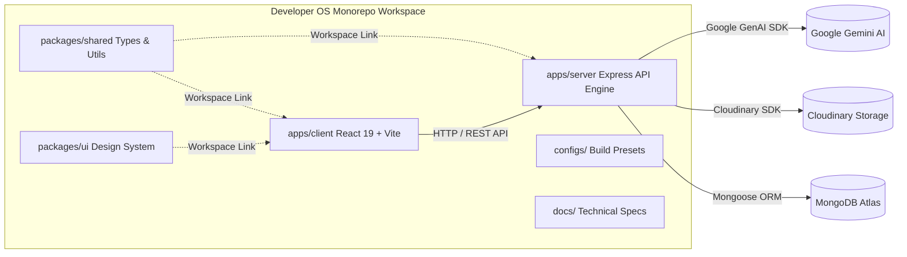

# Developer OS

### Production-grade Developer Platform

Built to demonstrate modern software engineering practices through a scalable portfolio platform, personal CMS, and extensible backend architecture.

Designed & Engineered by **Sagar.dev**.

---

[](docs/releases/README.md)
[](https://nodejs.org/)
[](https://react.dev/)
[](https://expressjs.com/)
[](https://www.mongodb.com/atlas)
[](https://cloudinary.com/)
[](https://deepmind.google/technologies/gemini/)
[](LICENSE)
[](docs/README.md)
[](docs/README.md)

---

## Workspace Quickstart

### Prerequisites
- **Node.js**: `>= 18.0.0`
- **pnpm**: `>= 8.0.0` (`npm install -g pnpm`)

### Local Setup Instructions

1. **Clone Repository & Install Dependencies**
   ```bash
   git clone https://github.com/sagardev/developer-os.git
   cd developer-os
   pnpm install
   ```

2. **Configure Environment Variables**
   ```bash
   cp .env.example .env
   cp apps/server/.env.example apps/server/.env
   ```

3. **Launch Local Development Servers**
   ```bash
   pnpm dev
   ```
   - Client App: `http://localhost:5173`
   - Server API Engine: `http://localhost:5000/api/v1`
   - Health Check: `http://localhost:5000/api/v1/health`

---

## Monorepo Architecture Topology



---

## Technology Stack

- **Frontend**: React 19, Vite, Tailwind CSS, TanStack Query, Axios
- **Backend**: Node.js, Express, Mongoose ORM, Cloudinary SDK, Google Gemini AI SDK, JWT Authentication, Refresh Tokens, `bcryptjs`, Winston Logger
- **Database**: MongoDB Atlas Cluster
- **Media & AI**: Cloudinary Media Management, Google Gemini AI (Gemini 2.0 Flash)
- **CI/CD & DevOps**: GitHub Actions CI, Docker
- **Tooling**: pnpm Workspaces, ESLint, Prettier, EditorConfig
- **Infrastructure**: Monorepo 5-tier layered server pattern (`Route` → `Controller` → `Service` → `Repository` → `Database`)

---

## Key Features

- **AI Assistant**: Streaming subagent integration powered by Google Gemini 2.0 Flash for content generation, code refactoring, and SEO optimization.
- **Portfolio CMS**: Comprehensive content administration for projects, skills, experience, contact messages, and platform settings.
- **JWT Authentication & Refresh Tokens**: Dual-token authentication with short-lived access JWTs and auto-rotating httpOnly refresh token cookies.
- **Cloudinary Media Platform**: Provider-agnostic asset management supporting secure buffer uploads, folder organization, and metadata tracking.
- **Admin Dashboard**: Secure control panel for managing portfolio data, monitoring system telemetry, and viewing real-time AI logs.
- **Role-Based Access Control (RBAC)**: Fine-grained authorization middleware separating public read access from admin management privileges.
- **RFC-driven Development**: Architectural discipline enforcing formal RFC specifications, design reviews, and runtime QA verification pipelines.
- **GitHub Actions CI/CD**: Automated integration workflows running linting, build verification, and type checking on every commit.
- **Monorepo Architecture**: Clean separation of concerns with shared packages, reusable UI primitives, and modular full-stack applications.

---

## Implemented Capabilities (v1.3.1)

- **Monorepo Workspace Foundation ([ESD-001](docs/releases/v0.1.0-monorepo-foundation.md))**: `pnpm` workspace setup, ESLint, Prettier, EditorConfig, and cross-package linking (`packages/shared`, `packages/ui`).
- **Backend Platform Engine ([RFC-002](docs/releases/v0.2.0-backend-platform.md))**: Express app/server decoupling, 5-tier layered architecture, native environment validation, Winston structured logger, security stack (`helmet`, `cors`, `express-rate-limit`), global error handling, and 5-tier health check API (`GET /api/v1/health`).
- **Identity Platform Foundation ([RFC-003](docs/releases/v0.3.0-identity-platform.md))**: User database schema, Dual JWT Access/Refresh tokens, `bcryptjs` password hashing, SHA-256 refresh token database hashing, `UserDTO` sanitization, Winston audit logging, and Role-Based Access Control (`Roles.ADMIN`, `Roles.USER`).
- **Public Portfolio & CMS Engine (RFC-004)**: Dynamic home, project showcase, experience timeline, interactive skills matrix, and settings repository.
- **Contact & Messaging System (RFC-005)**: Contact form submission pipeline with rate limiting, email notifications, and admin inbox management.
- **System Telemetry & Platform Settings (RFC-007)**: Dynamic platform configuration, system telemetry logging, maintenance mode guard, and admin telemetry panel.
- **Google Gemini AI Integration (RFC-008)**: Server-sent events (SSE) streaming engine, Gemini 2.0 Flash integration, prompt template engine, AI usage telemetry logging, and interactive AI assistant drawer.
- **Cloudinary Media Platform (RFC-009)**: Provider-agnostic media storage layer, memory buffer upload streaming, soft-delete preparation, configurable upload limits (`MAX_FILE_SIZE_MB`), and centralized `MediaFolder` enum constants.
- **Authentication Stability Hotfix (v1.3.1)**: Axios error response metadata preservation, client-side automatic token refresh interceptor, and declarative React Router session expiration routing.

---

## Product Roadmap

- **RFC-010**: Media Manager UI & Asset Selector Modal
- **RFC-011**: Projects CMS Enhancement & Markdown Editor
- **RFC-012**: Skills CMS Enhancement & Grouping Filters
- **RFC-013**: Experience CMS Enhancement & Rich Text Highlights
- **Production Deployment**: Automated Docker & Kubernetes staging/production pipeline

---

## Screenshots

### Public Portfolio

*Modern responsive developer portfolio with dynamic projects matrix and skills showcase.*

### Admin Dashboard

*Centralized management hub for platform settings, telemetry analytics, and CMS operations.*

### Authentication

*Secure admin portal login with dual JWT authorization and automated token rotation.*

### AI Assistant

*Real-time streaming AI subagent powered by Google Gemini 2.0 Flash.*

### Media Platform

*Cloudinary-backed media asset management with folder categorization and metadata storage.*

---

## Release History

- **v1.3.1**: Authentication Stability Hotfix (Axios interceptor error preservation & declarative token refresh handling)
- **v1.3.0**: Media Platform (Cloudinary integration, buffer streaming & provider-agnostic storage layer)
- **v1.2.0**: AI Integration (Google Gemini 2.0 Flash streaming engine & AI assistant drawer)
- **v1.1.0**: CMS Platform (Public portfolio, contact engine, telemetry & admin control panel)
- **v1.0.0**: Identity Platform (Dual JWT authentication, RBAC & security stack)

---

## Documentation Hub

All technical specifications, architectural blueprints, API references, and release notes are maintained in the **[Developer OS Documentation Hub](docs/README.md)**.

Consult **[docs/README.md](docs/README.md)** as the primary gateway for all documentation.

---

## Project Status

| Metric | Status |
| :--- | :--- |
| **Current Release** | `v1.3.1` |
| **Completed RFCs** | RFC-001 through RFC-009 |
| **Documentation Standard** | Enterprise Standard ([DOC-000](docs/DOC-000-style-guide.md)) |
| **Status** | Production Candidate |

---

## Scripts Reference

All scripts are executed from the monorepo root via `pnpm`:

- `pnpm dev`: Runs client and server concurrently with live reload.
- `pnpm build`: Compiles all workspace packages and applications.
- `pnpm lint`: Runs ESLint code quality checks across the entire monorepo.
- `pnpm format`: Runs Prettier formatter across all source files.

---

Built with engineering discipline, semantic versioning, and RFC-driven development.

© **Sagar.dev**
