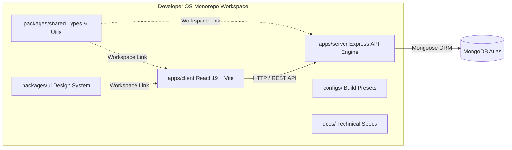

# Developer OS

### Production-grade Developer Platform

Built to demonstrate modern software engineering practices through a scalable portfolio platform, personal CMS, and extensible backend architecture.

Designed & Engineered by **Sagar.dev**.

---

[](docs/releases/v0.3.0-identity-platform.md)
[](https://nodejs.org/)
[](https://react.dev/)
[](https://expressjs.com/)
[](https://www.mongodb.com/atlas)
[](LICENSE)
[](docs/README.md)
[](docs/README.md)

---

## Workspace Quickstart

### Prerequisites
- **Node.js**: `>= 18.0.0`
- **pnpm**: `>= 8.0.0` (`npm install -g pnpm`)

### Local Setup Instructions

1. **Clone Repository & Install Dependencies**
   ```bash
   git clone https://github.com/sagardev/developer-os.git
   cd developer-os
   pnpm install
   ```

2. **Configure Environment Variables**
   ```bash
   cp .env.example .env
   cp apps/server/.env.example apps/server/.env
   ```

3. **Launch Local Development Servers**
   ```bash
   pnpm dev
   ```
   - Client App: `http://localhost:5173`
   - Server API Engine: `http://localhost:5000/api/v1`
   - Health Check: `http://localhost:5000/api/v1/health`

---

## Monorepo Architecture Topology



---

## Technology Stack

- **Frontend**: React 19, Vite, Tailwind CSS, TanStack Query, Axios
- **Backend**: Node.js, Express, Mongoose ORM, JWT, `bcryptjs`, Winston Logger
- **Database**: MongoDB Atlas Cluster
- **Tooling**: pnpm Workspaces, ESLint, Prettier, EditorConfig
- **Infrastructure**: Monorepo 5-tier layered server pattern (`Route` → `Controller` → `Service` → `Repository` → `Database`)

---

## Implemented Capabilities (v0.3.0)

- **Monorepo Workspace Foundation ([ESD-001](docs/releases/v0.1.0-monorepo-foundation.md))**: `pnpm` workspace setup, ESLint, Prettier, EditorConfig, and cross-package linking (`packages/shared`, `packages/ui`).
- **Backend Platform Engine ([RFC-002](docs/releases/v0.2.0-backend-platform.md))**: Express app/server decoupling, 5-tier layered architecture, native environment validation, Winston structured logger, security stack (`helmet`, `cors`, `express-rate-limit`), global error handling, and 5-tier health check API (`GET /api/v1/health`).
- **Identity Platform Foundation ([RFC-003](docs/releases/v0.3.0-identity-platform.md))**: User database schema, Dual JWT Access/Refresh tokens, `bcryptjs` password hashing, SHA-256 refresh token database hashing, `UserDTO` sanitization, Winston audit logging, and Role-Based Access Control (`Roles.ADMIN`, `Roles.USER`).

---

## Product Roadmap

Planned modules for future releases:
- **RFC-004**: Public Portfolio & CMS Engine
- **RFC-005**: Blog Engine & Markdown Parser
- **RFC-006**: Media Asset Manager (Cloudinary Integration)
- **RFC-007**: System Analytics & Contact Management
- **RFC-008**: AI Integration Layer & Subagent Automation

---

## Screenshots

*Coming in v0.4.0*

This section will showcase:
- Home Page & Public Portfolio
- Developer Dashboard
- Authentication Flows
- Admin CMS
- Mobile Views

---

## Documentation Hub

All technical specifications, architectural blueprints, API references, and release notes are maintained in the **[Developer OS Documentation Hub](docs/README.md)**.

Consult **[docs/README.md](docs/README.md)** as the primary gateway for all documentation.

---

## Project Status

| Metric | Status |
| :--- | :--- |
| **Current Release** | `v0.3.0` |
| **Completed RFCs** | 3 (`ESD-001`, `RFC-002`, `RFC-003`) |
| **Documentation Standard** | Enterprise Standard ([DOC-000](docs/DOC-000-style-guide.md)) |
| **Status** | Active Development |

---

## Scripts Reference

All scripts are executed from the monorepo root via `pnpm`:

- `pnpm dev`: Runs client and server concurrently with live reload.
- `pnpm build`: Compiles all workspace packages and applications.
- `pnpm lint`: Runs ESLint code quality checks across the entire monorepo.
- `pnpm format`: Runs Prettier formatter across all source files.

---

Built with engineering discipline, semantic versioning, and RFC-driven development.

© **Sagar.dev**
