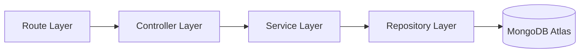

# DOC-000: Developer OS Documentation Style Guide

> **Purpose**: Establishes enterprise documentation standards, writing tone, markdown conventions, code block formatting, diagram rules, and link conventions across Developer OS.  
> **Document Status**: Active  
> **Audience**: All Engineering Team Members & Technical Contributors  
> **Last Updated Version**: v0.3.0  
> **Estimated Reading Time**: 4 min read  
> **Related Documents**: [Documentation Index](README.md) | [System Architecture](../ARCHITECTURE.md) | [Root README](../README.md)

---

## Navigation
**[Documentation Index](README.md)** | **[Next: Documentation Index →](README.md)**

---

## 1. Documentation Principles

All Developer OS documentation is governed by six fundamental engineering principles:

1. **Accuracy**: Documentation must accurately reflect the codebase. No speculative or unverified claims.
2. **Single Source of Truth**: Every technical spec has exactly one canonical location. Never duplicate details; summarize and link.
3. **Incremental Updates**: Documentation evolves in lockstep with RFC implementations. Every feature PR includes doc updates.
4. **Implementation First**: Document only implemented capabilities (`v0.3.0`). Planned features belong strictly in the Roadmap.
5. **Consistency**: Uniform structure, metadata, naming, and formatting across every single file.
6. **Maintainability**: Clear breadcrumbs, relative linking, and modular layout ensure long-term ease of maintenance.

---

## 2. Writing Tone & Voice

Developer OS documentation adheres to enterprise technical standards used by Vercel, Supabase, Payload CMS, and Turborepo.

- **Authoritative & Senior Staff Level**: Write with clarity, technical accuracy, and engineering precision.
- **Concise & Direct**: Avoid unnecessary fluff, marketing jargon, or redundant intros.
- **Emoji Usage**: Use emojis sparingly for structural indicators (e.g. 📄 documents, 📁 directories, 🚀 releases, ⚠️ alerts). Avoid decorative inline emoji noise in body text.

---

## 3. Document Layout & Metadata Standard

Every Markdown document inside `docs/` MUST begin with the standardized metadata header shown below:

```markdown
# [Document Title]

> **Purpose**: [1-2 sentence description of document objectives]  
> **Document Status**: Active | Draft | Deprecated | Superseded  
> **Audience**: [Target audience, e.g., Backend Engineers, System Architects]  
> **Last Updated Version**: vX.Y.Z  
> **Estimated Reading Time**: X min read  
> **Related Documents**: [Link 1](path) | [Link 2](path)

---

## Navigation
**[← Previous Document](path)** | **[Documentation Index](path)** | **[Next Document →](path)**

---
```

---

## 4. Heading Hierarchy

Maintain a strict, non-skipping heading structure for readability and automated TOC generators:

- `# Document Title` (Level 1 — Single H1 per document)
- `## 1. Section Title` (Level 2 — Major technical sections)
- `### 1.1 Subsection Title` (Level 3 — Detailed subcomponents)
- `#### Component Name` (Level 4 — Specific file or function names)

Do not skip heading levels (e.g., jumping from `#` directly to `###`).

---

## 5. Markdown Conventions & GitHub Callout Alerts

Use GitHub-native blockquote alerts to highlight critical operational context:

> [!NOTE]
> Background architectural context or explanatory design details.

> [!IMPORTANT]
> Essential security requirements, mandatory constraints, or critical operational rules.

> [!TIP]
> Developer workflow optimizations and efficiency recommendations.

> [!WARNING]
> Security risks, environment variable dependencies, or potential pitfalls.

---

## 6. Code Block Standards

All code snippets MUST be fenced with three backticks and include explicit language identifiers:

````markdown
```javascript
import { config } from './config/env.config.js';
import { logger } from './config/logger.js';
```
````

### Supported Language Identifiers:
- `javascript` / `js`: Express controllers, services, utilities, Node scripts.
- `typescript` / `ts`: React components, TypeScript types, schemas.
- `json`: `package.json`, API payloads, configuration presets.
- `bash` / `shell`: Terminal commands, pnpm scripts.
- `env`: Environment variable definitions (`.env.example`).
- `mermaid`: Inline architecture and sequence diagrams.

---

## 7. Left-Aligned Table Standards

All Markdown tables must standardize on explicit left-alignment syntax (`:---`) for all columns:

```markdown
| Field | Type | Required | Description |
| :--- | :--- | :--- | :--- |
| `name` | String | Yes | User display name (2-50 characters) |
| `email` | String | Yes | Unique normalized email address |
```

---

## 8. Diagram Conventions (Mermaid Flowchart LR)

Prefer Mermaid `flowchart LR` (Left-to-Right) layout for architecture topology and data flows unless a top-down or sequence layout is distinctly superior:

````markdown

````

Static exported images (`.png` / `.svg`) are reserved exclusively for complex visual branding assets in `assets/diagrams/` or `assets/branding/`.

---

## 9. Internal Linking & Naming Conventions

- **Relative Paths Only**: All links within documentation MUST use relative Markdown file paths.
  - Correct: `[User Model](../apps/server/src/models/user.model.js)`
  - Incorrect: `[User Model](C:\Users\Creative\...)` or `file:///C:/Users/...`
- **File Naming**: Lowercase kebab-case for documentation files (e.g., `current-vs-future.md`, `v0.3.0-identity-platform.md`).
- **No Broken Links**: All internal file references must be verified prior to release.

---

## 10. Future RFC Maintenance Protocol

When a new feature or RFC is released:
1. Create a release note under `docs/releases/vX.Y.Z-<rfc-name>.md`.
2. Update the corresponding technical documents in `docs/backend/`, `docs/authentication/`, `docs/api/`, etc.
3. Update `Last Updated Version` in headers of modified docs.
4. Append version notes to root `CHANGELOG.md`.

---

## Navigation
**[Documentation Index](README.md)** | **[Next: Documentation Index →](README.md)**
