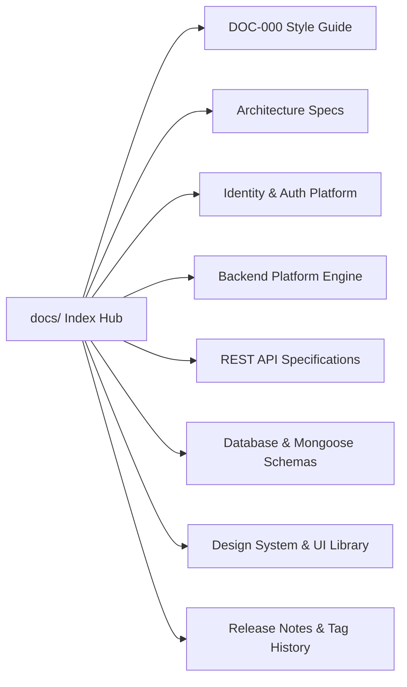
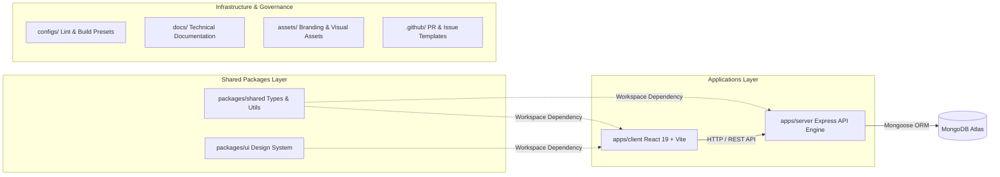

# Developer OS Documentation Hub

> **Purpose**: Serves as the central gateway and directory index for all Developer OS technical documentation, specifications, architecture blueprints, and release notes.  
> **Document Status**: Active  
> **Audience**: Engineers, Architects, Tech Leads, and Contributors  
> **Documentation Version**: v0.3.0  
> **Last Updated Version**: v0.3.0  
> **Estimated Reading Time**: 4 min read  
> **Related Documents**: [DOC-000 Style Guide](DOC-000-style-guide.md) | [Root README](../README.md) | [System Architecture](../ARCHITECTURE.md) | [Release Notes](releases/README.md)

---

## Navigation
**[← Root README](../README.md)** | **[Documentation Index](README.md)** | **[Next: System Architecture →](../ARCHITECTURE.md)** | **[Release Documentation →](releases/README.md)**

---

## 1. Documentation Index & Navigation Map

Welcome to the **Developer OS (Brand: Sagar.dev)** documentation repository. Select a domain below to access technical specifications:

### Documentation Directory Reference:

| Directory / File | Description | Canonical Target |
| :--- | :--- | :--- |
| 📄 **[DOC-000 Style Guide](DOC-000-style-guide.md)** | Documentation standards, metadata rules, Mermaid layout, callout alerts, and style conventions. | [docs/DOC-000-style-guide.md](DOC-000-style-guide.md) |
| 📁 **[Architecture](architecture/README.md)** | Monorepo topology, 5-tier layered architecture (`Route` → `Controller` → `Service` → `Repository` → `Database`), and current vs. planned architecture breakdown. | [docs/architecture/README.md](architecture/README.md) |
| 📁 **[Identity & Auth](authentication/README.md)** | RFC-003 Identity Platform: Dual JWT tokens (Access 15m / Refresh 7d), `bcryptjs` hashing, SHA-256 token database storage, `UserDTO` sanitization, and RBAC middleware. | [docs/authentication/README.md](authentication/README.md) |
| 📁 **[Backend Platform](backend/README.md)** | Express backend foundation: App/Server lifecycle split, environment validation, Winston logger, security stack (`helmet`, `cors`, `rateLimit`), and global error handling. | [docs/backend/README.md](backend/README.md) |
| 📁 **[API Specifications](api/README.md)** | REST API design rules, `ApiResponse` envelopes, `ApiError` structures, and reference guide for active endpoints (`/api/v1/health`, `/api/v1/auth/*`). | [docs/api/README.md](api/README.md) |
| 📁 **[Database Specs](database/README.md)** | MongoDB Atlas cluster settings, connection lifecycle management, Mongoose ORM models, and indexing constraints. | [docs/database/README.md](database/README.md) |
| 📁 **[Design System](design-system/README.md)** | Developer OS Design Language: Color tokens (Royal Purple, Electric Cyan), typography, and `packages/ui` component primitives. | [docs/design-system/README.md](design-system/README.md) |
| 📁 **[Meeting Notes](meeting-notes/README.md)** | Architecture alignment syncs, sprint planning logs, and technical discussion records. | [docs/meeting-notes/README.md](meeting-notes/README.md) |
| 📁 **[Release Notes](releases/README.md)** | Version tag history (`v0.1.0`, `v0.2.0`, `v0.3.0`) and RFC milestone release logs. | [docs/releases/README.md](releases/README.md) |

---

## 2. Complete Monorepo Repository Structure

Developer OS is engineered as a production-grade full-stack monorepo managed via `pnpm` workspaces:

---

## 3. Documentation Coverage Status (v0.3.0)

| Technical Domain | RFC Milestone | Implemented Capability | Documentation Status |
| :--- | :--- | :--- | :--- |
| **Monorepo Topology** | ESD-001 / Tag v0.1.0 | `pnpm` workspaces, shared packages (`shared`, `ui`) | Complete (Active) |
| **Backend Foundation** | RFC-002 / Tag v0.2.0 | Express engine, 5-tier pattern, Winston logger, Health API | Complete (Active) |
| **Identity Platform** | RFC-003 / Tag v0.3.0 | Dual JWT tokens, `bcryptjs`, SHA-256 token hashes, RBAC, UserDTO | Complete (Active) |
| **Database Architecture** | RFC-002 & RFC-003 | MongoDB connection lifecycle, User schema indexes | Complete (Active) |
| **REST API Reference** | RFC-002 & RFC-003 | Implemented endpoints (`/health`, `/auth/*`), envelopes | Complete (Active) |
| **Design System** | Phase 1 Foundation | Developer OS Design Language, design tokens | Complete (Active) |
| **Public Portfolio CMS** | Planned | Content Management System for portfolio features | Roadmap Only |
| **Media & Blog Engine** | Planned | Asset uploads, markdown blog rendering | Roadmap Only |
| **AI Integration Layer** | Planned | LLM subagent automation and client features | Roadmap Only |

---

## 4. Maintenance & Contribution Protocol

To contribute updates to Developer OS documentation:
1. Review the **[DOC-000 Style Guide](DOC-000-style-guide.md)** for formatting rules.
2. Ensure every doc includes the required metadata header block.
3. Verify that all internal relative links resolve without errors.
4. When releasing a new RFC, create a corresponding release note in `docs/releases/vX.Y.Z-<rfc-name>.md` and update `CHANGELOG.md`.

---

## Navigation
**[← Root README](../README.md)** | **[Documentation Index](README.md)** | **[Next: System Architecture →](../ARCHITECTURE.md)** | **[Release Documentation →](releases/README.md)**
