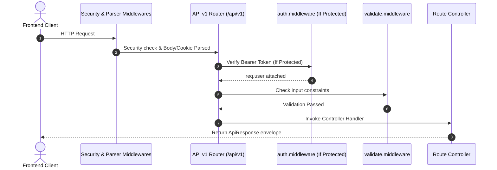

# REST API Specifications & Contracts

> **Purpose**: Technical overview of Developer OS REST API platform, versioning strategy, standard response/error envelopes (`ApiResponse`, `ApiError`), HTTP status codes, validation rules, and error handling protocols.  
> **Document Status**: Active  
> **Audience**: Frontend Engineers, Backend Engineers, and API Integration Developers  
> **Last Updated Version**: v0.3.0  
> **Estimated Reading Time**: 4 min read  
> **Related Documents**: [DOC-000 Style Guide](../DOC-000-style-guide.md) | [Documentation Index](../README.md) | [System Architecture Blueprint](../../ARCHITECTURE.md) | [Endpoints Reference](endpoints.md) | [Identity Platform Specs](../authentication/README.md)

---

## Navigation
**[← Identity & Auth Specs](../authentication/README.md)** | **[API Overview](README.md)** | **[Next: Endpoints Reference →](endpoints.md)**

---

## 1. API Overview & Base URLs

The Developer OS API is a RESTful web service built with Node.js and Express. It uses JSON for request payloads and response envelopes, and communicates over HTTP/HTTPS.

### Environment Base URLs:
- **Local Development**: `http://localhost:5000/api/v1`
- **Production API**: `https://api.sagar.dev/api/v1`

---

## 2. API Versioning Strategy

All platform endpoints are explicitly prefixed with a major version path (`/api/v1`). 
- **Backwards Compatibility**: Non-breaking additions (e.g., new optional fields or endpoints) are added under `/api/v1`.
- **Breaking Changes**: Architectural modifications breaking contract compatibility will increment to `/api/v2`.

---

## 3. Authentication Requirements

Endpoints are classified into two access levels:

1. **Public Endpoints**: Accessible without credentials (e.g., `GET /api/v1/health`, `POST /api/v1/auth/login`).
2. **Protected Endpoints**: Require a valid JWT Access Token passed in the HTTP request header:
   ```http
   Authorization: Bearer <access_token>
   ```

*Session Renewal*: Session refresh endpoints (`POST /api/v1/auth/refresh-token`) utilize an `httpOnly` secure cookie (`refreshToken`) sent automatically by browsers.

---

## 4. Standard Request Lifecycle



---

## 5. Standardized Response Envelopes

To ensure seamless integration for frontend consumers, Developer OS wraps all HTTP responses in uniform JSON envelopes generated by `ApiResponse` and `ApiError` utilities:

### A. Success Envelope Schema (`ApiResponse.success`)
```json
{
  "success": true,
  "statusCode": 200,
  "message": "Operation completed successfully.",
  "data": { ... },
  "timestamp": "2026-08-03T00:00:00.000Z"
}
```

### B. Error Envelope Schema (`ApiResponse.error`)
```json
{
  "success": false,
  "statusCode": 400,
  "message": "Request validation failed due to invalid parameters.",
  "errors": [
    {
      "field": "email",
      "message": "Please provide a valid email address",
      "value": "invalid-email"
    }
  ],
  "timestamp": "2026-08-03T00:00:00.000Z"
}
```

---

## 6. HTTP Status Code Strategy

The backend platform maps HTTP status codes using system constants in [`src/constants/httpStatus.js`](../../apps/server/src/constants/httpStatus.js):

| Code | Status Symbol | Usage Scenario |
| :--- | :--- | :--- |
| `200` | `OK` | Standard successful response for `GET`, `PUT`, `PATCH`, `DELETE` operations or login. |
| `201` | `CREATED` | Resource successfully created (e.g., user registration). |
| `400` | `BAD_REQUEST` | Client error, invalid JSON payload, or validation failure. |
| `401` | `UNAUTHORIZED` | Missing, invalid, or expired Bearer access token / bad credentials. |
| `403` | `FORBIDDEN` | Valid token, but user lacks required role permissions (`authorize(Roles.ADMIN)`). |
| `404` | `NOT_FOUND` | Unmapped route path or database record not found. |
| `409` | `CONFLICT` | Resource collision (e.g. duplicate user registration email). |
| `429` | `TOO_MANY_REQUESTS` | Rate limiter threshold exceeded. |
| `500` | `INTERNAL_SERVER_ERROR` | Unhandled operational error or backend crash. |

---

## 7. Active Implemented Endpoints Summary (v0.3.0)

For detailed request payloads, headers, and code examples, view **[endpoints.md](endpoints.md)**:

| Endpoint Path | Method | Auth Required | Purpose |
| :--- | :--- | :--- | :--- |
| `/api/v1/health` | `GET` | No | Uptime diagnostics and database ping check. |
| `/api/v1/auth/register` | `POST` | No | Registers user, hashes password, returns access token & cookie. |
| `/api/v1/auth/login` | `POST` | No | Authenticates user credentials, returns access token & cookie. |
| `/api/v1/auth/logout` | `POST` | Yes (Bearer) | Revokes refresh token in DB and clears httpOnly cookie. |
| `/api/v1/auth/refresh-token` | `POST` | Cookie / Body | Rotates refresh token and issues new access token pair. |
| `/api/v1/auth/me` | `GET` | Yes (Bearer) | Returns profile of currently authenticated user. |

---

## Navigation
**[← Identity & Auth Specs](../authentication/README.md)** | **[API Overview](README.md)** | **[Next: Endpoints Reference →](endpoints.md)**
