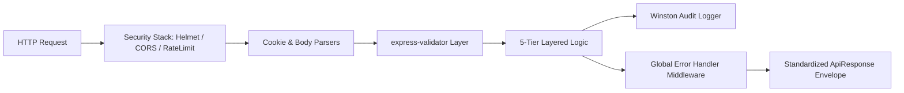

# Architecture Specifications & Architectural Decision Records (ADRs)

> **Purpose**: Provides deep architectural specifications, cross-cutting concern guidelines, runtime request execution flows, and architectural decision records (ADRs) for Developer OS.  
> **Document Status**: Active  
> **Audience**: System Architects, Senior Software Engineers, and Backend Engineering Contributors  
> **Last Updated Version**: v0.3.0  
> **Estimated Reading Time**: 5 min read  
> **Related Documents**: [DOC-000 Style Guide](../DOC-000-style-guide.md) | [Documentation Index](../README.md) | [System Architecture Blueprint](../../ARCHITECTURE.md) | [Current vs Future Architecture](current-vs-future.md)

---

## Navigation
**[← Documentation Index](../README.md)** | **[Architecture Index](README.md)** | **[Next: Current vs Future Architecture →](current-vs-future.md)**

---

## 1. Architectural Governance & Core Principles

Developer OS architectural design is guided by five enterprise system principles:

1. **Separation of Concerns**: Strict boundaries between HTTP handling, business orchestration, data access, and storage.
2. **Type Safety & Schema Integrity**: Shared types and schemas in `packages/shared` enforce contracts across client and server boundaries.
3. **Fail-Fast Environment Validation**: System halts execution at boot time if required environment configurations are missing.
4. **Defense-in-Depth Security**: Layered security including Helmet HTTP headers, dynamic CORS domain matching, rate limiting, bcryptjs password hashing, and SHA-256 refresh token database hashing.
5. **Traceability & Auditability**: Winston structured logging captures operational metrics and audit trails without revealing sensitive keys or plaintext passwords.

---

## 2. Cross-Cutting Concerns Architecture

Cross-cutting concerns are decoupled from domain logic using middleware composition and configuration abstractions:

### Key Infrastructure Controls:

| Cross-Cutting Domain | Implementation Abstraction | Operational Responsibility | Detail Reference |
| :--- | :--- | :--- | :--- |
| **Configuration** | `src/config/env.config.js` | Native environment validation and frozen config export | [Backend Docs](../backend/README.md) |
| **Logger Abstraction** | `src/config/logger.js` | Winston structured JSON/colorized logging & audit logs | [Backend Docs](../backend/README.md) |
| **Database Connection** | `src/config/db.config.js` | Mongoose connection lifecycle & graceful shutdown | [Database Docs](../database/README.md) |
| **Security Stack** | `src/middleware/security.middleware.js` | Helmet, dynamic CORS origin matching, rate limiting | [Backend Docs](../backend/README.md) |
| **Validation Layer** | `src/middleware/validate.middleware.js` | Standardized `express-validator` result enforcement | [API Docs](../api/README.md) |
| **Error Architecture** | `src/middleware/errorHandler.middleware.js` | Centralized `ApiError` serialization and sanitization | [API Docs](../api/README.md) |

---

## 3. Architectural Decision Records (ADRs)

### ADR-001: Selection of pnpm Monorepo Workspace Strategy
- **Status**: Accepted
- **Context**: Need a scalable monorepo structure to share TypeScript models, UI design tokens, and config presets across client and server applications.
- **Decision**: Adopt `pnpm` workspaces (`apps/client`, `apps/server`, `packages/shared`, `packages/ui`).
- **Consequences**: Fast disk-space efficient installation, strict dependency isolation, and zero phantom dependencies.

### ADR-002: Strict 5-Tier Layered Backend Architecture
- **Status**: Accepted
- **Context**: Unstructured Express backends frequently suffer from fat controllers, tight database coupling, and untestable code.
- **Decision**: Enforce a rigid 5-tier structure: `Route` → `Controller` → `Service` → `Repository` → `Database Model`.
- **Consequences**: Controllers remain thin, Services contain 100% of business logic without HTTP dependency, Repositories isolate Mongoose queries.

### ADR-003: Dual-Token JWT Authentication with SHA-256 Token Hashing
- **Status**: Accepted
- **Context**: Storing raw refresh tokens in database creates security risks; short-lived access tokens require secure renewal.
- **Decision**: Issue 15m Access Tokens in body/header and 7d Refresh Tokens in `httpOnly` cookies. Store ONLY SHA-256 hashes (`hashToken()`) of refresh tokens in MongoDB.
- **Consequences**: Complete protection against database leak replay attacks and support for instant token revocation upon logout.

---

## 4. Architecture Directory Index

- 📄 **[Current vs. Future Architecture Specification](current-vs-future.md)**: Detailed breakdown comparing the active v0.3.0 implementation against planned future RFC modules.

---

## Navigation
**[← Documentation Index](../README.md)** | **[Architecture Index](README.md)** | **[Next: Current vs Future Architecture →](current-vs-future.md)**
