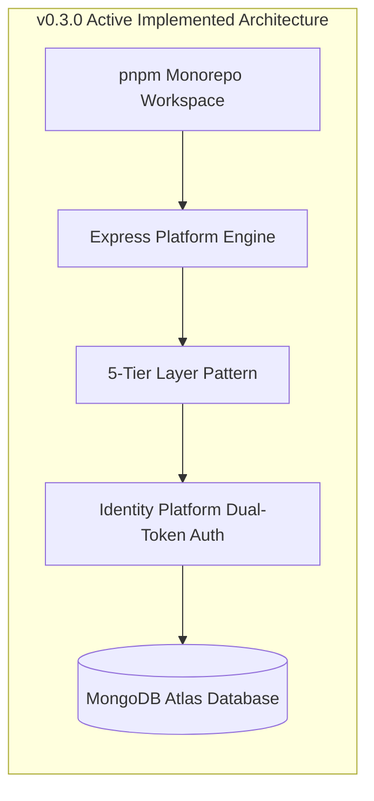
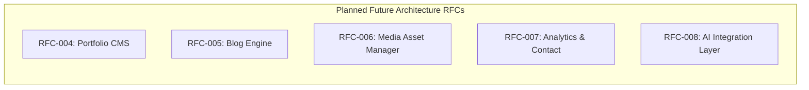

# Current Implemented Architecture vs. Future System Roadmap

> **Purpose**: Explicitly details the active v0.3.0 architectural stack while outlining future planned modules, migration strategies, and architectural boundaries.  
> **Document Status**: Active  
> **Audience**: System Architects, Lead Engineers, and Technical Contributors  
> **Last Updated Version**: v0.3.0  
> **Estimated Reading Time**: 4 min read  
> **Related Documents**: [DOC-000 Style Guide](../DOC-000-style-guide.md) | [Documentation Index](../README.md) | [Architecture Index](README.md) | [System Architecture Blueprint](../../ARCHITECTURE.md)

---

## Navigation
**[← Architecture Index](README.md)** | **[Current vs Future Architecture](current-vs-future.md)** | **[Next: Backend Engine →](../backend/README.md)**

---

## 1. Implemented Architecture Stack (v0.3.0)

As of release tag **`v0.3.0`**, the following architectural layers are 100% operational in production:

### Implemented Infrastructure Capabilities:
- **Workspace Architecture**: `pnpm` workspace linking `apps/client`, `apps/server`, `packages/shared`, `packages/ui`, and `configs/`.
- **Backend Core**: Decoupled `app.js`/`server.js`, native environment config validation, Winston structured logger, security middleware stack (`helmet`, dynamic `cors`, `express-rate-limit`), and centralized error handling middleware (`errorHandler.middleware.js`).
- **5-Tier Pattern**: Strict execution sequence: `Route` → `Controller` → `Service` → `Repository` → `Database Model`.
- **Identity Platform**: User database model, `bcryptjs` password hashing, dual JWT token generation (15m Access / 7d `httpOnly` Refresh Cookie), SHA-256 refresh token database hashing, `UserDTO` serialization, Winston audit logs, and Role-Based Access Control (`Roles.ADMIN`, `Roles.USER`).
- **Health Diagnostics**: Single 5-tier diagnostic route `GET /api/v1/health` returning system uptime, memory usage, and database ping statistics.

---

## 2. Future System Architecture Roadmap

Future capabilities are planned across discrete RFC milestones. Unimplemented capabilities remain strictly inside the roadmap and are not exposed in production API contracts:

### Planned Module Specifications:

| RFC Milestone | Target Domain | Architecture Pattern to Extend |
| :--- | :--- | :--- |
| **RFC-004** | Portfolio CMS | Portfolio, Project, & Skill models extending 5-tier `Route` → `Controller` → `Service` → `Repository` structure. |
| **RFC-005** | Blog Engine | Post schema, tag indexing, AST Markdown rendering service, and public/draft status controllers. |
| **RFC-006** | Media Manager | Cloudinary SDK storage abstraction repository, multer file stream validation middleware. |
| **RFC-007** | Analytics & Contact | Contact submission persistence, rate-limited contact routes, and aggregated system metrics services. |
| **RFC-008** | AI Integration | LLM agent service wrappers, prompt template engine, streaming HTTP response controllers. |

---

## 3. Architectural Comparison Matrix

| System Boundary | Current Status (v0.3.0) | Future Roadmap Extension |
| :--- | :--- | :--- |
| **Authentication** | Active: Dual JWT, `httpOnly` cookie, SHA-256 DB hashes | OAuth2 / Social Login provider integration |
| **User Roles** | Active: `Roles.ADMIN`, `Roles.USER` | Granular permission scopes per resource |
| **Database Collections** | Active: `users` collection | `projects`, `posts`, `assets`, `messages` collections |
| **API Endpoints** | Active: `/api/v1/health`, `/api/v1/auth/*` | `/api/v1/projects`, `/api/v1/posts`, `/api/v1/media` |
| **File Storage** | Active: Memory / Buffer handling | Cloudinary cloud media storage repository |
| **AI Integration** | Active: None | Subagent workflow orchestrators & stream handlers |

---

## 4. Evolution & Migration Guidelines

When implementing future RFC modules:
1. **Preserve Existing Layers**: New features must fit into the existing 5-tier structure without introducing direct database access in controllers or HTTP dependencies in services.
2. **Reuse Platform Foundation**: All future routes MUST utilize the established `validate.middleware.js`, `auth.middleware.js`, `role.middleware.js`, `ApiResponse`, and `ApiError` utilities.
3. **Documentation Updates**: Every new RFC milestone implementation MUST update this document, moving the completed RFC from Section 2 (Roadmap) to Section 1 (Implemented).

---

## Navigation
**[← Architecture Index](README.md)** | **[Current vs Future Architecture](current-vs-future.md)** | **[Next: Backend Engine →](../backend/README.md)**
