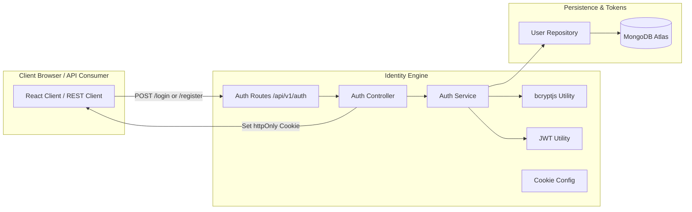
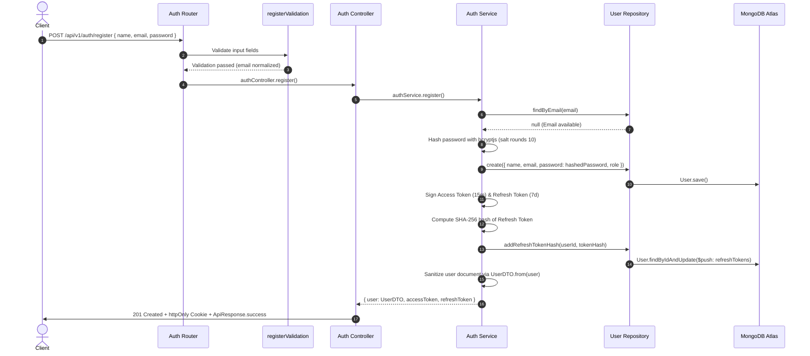
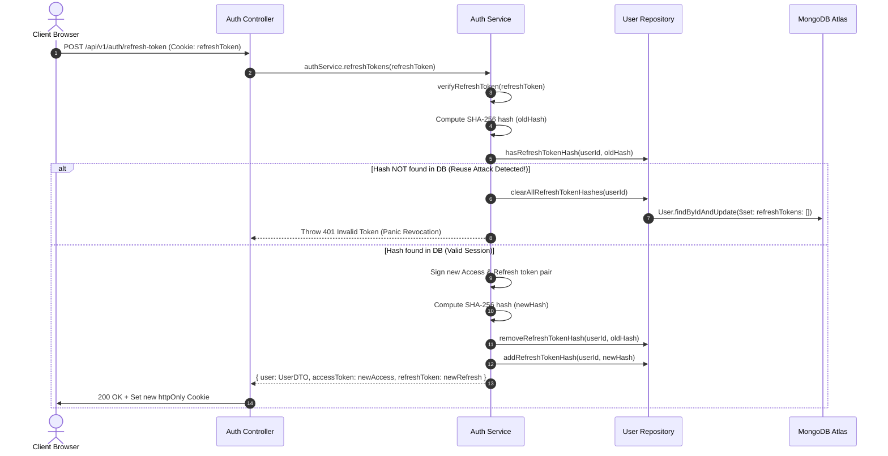

# Identity Platform Architecture & Specifications

> **Purpose**: Complete technical specification of Developer OS RFC-003 Identity Platform, covering authentication flows, dual-token JWT lifecycle, bcryptjs password hashing, SHA-256 refresh token database hashing, UserDTO sanitization, and Role-Based Access Control (RBAC).  
> **Document Status**: Active  
> **Audience**: Backend Engineers, Security Engineers, and System Architects  
> **Last Updated Version**: v0.3.0  
> **Estimated Reading Time**: 6 min read  
> **Related Documents**: [DOC-000 Style Guide](../DOC-000-style-guide.md) | [Documentation Index](../README.md) | [System Architecture Blueprint](../../ARCHITECTURE.md) | [Backend Engine Specs](../backend/README.md) | [REST API Specs](../api/README.md)

---

## Navigation
**[← Backend Engine Specs](../backend/README.md)** | **[Identity & Auth Specs](README.md)** | **[Next: REST API Specs →](../api/README.md)**

---

## 1. Identity Platform Overview

The Developer OS **Identity Platform** ([`RFC-003`](../releases/v0.3.0-identity-platform.md)) provides secure, production-grade authentication and authorization across the platform. Built on top of our 5-tier architecture, it enforces a dual-token JWT authentication strategy, bcryptjs password hashing, database-level SHA-256 refresh token hashing, and declarative Role-Based Access Control (RBAC).



---

## 2. Dual-Token Architecture & Lifecycle

Developer OS decouples authentication persistence into short-lived access credentials and long-lived session renewal keys:

| Token Type | Expiration | Signing Secret Env Key | Transmission Vector | Storage Location | Payload Contents |
| :--- | :--- | :--- | :--- | :--- | :--- |
| **Access Token** | `15m` | `JWT_ACCESS_SECRET` | JSON payload response | In-memory / Bearer header | `{ userId, email, role }` |
| **Refresh Token** | `7d` | `JWT_REFRESH_SECRET` | `httpOnly` secure cookie | SHA-256 Hash stored in DB | `{ userId }` |

---

## 3. Core Authentication Workflows

### A. User Registration Flow (`POST /api/v1/auth/register`)



### B. User Login Flow (`POST /api/v1/auth/login`)

1. **Credential Lookup**: Normalizes email input (`trim().toLowerCase()`) and queries database with `.select('+password')`.
2. **Generic Error Security**: If user does not exist or `isActive === false`, throws generic `401 Unauthorized` (`Invalid email or password`).
3. **Password Verification**: Compares plaintext password against hash using `comparePassword()`. If invalid, throws generic `401 Unauthorized`.
4. **Token Generation & SHA-256 Storage**: Generates new Access & Refresh tokens. Hashes refresh token with SHA-256 and persists in `user.refreshTokens`.
5. **Audit Logging**: Logs `logger.info('[Audit] User logged in successfully', { userId })` without logging passwords or plain tokens.

---

## 4. Refresh Token Rotation & Reuse Security

To protect against stolen refresh token replay attacks, Developer OS implements **Refresh Token Rotation**:



---

## 5. Security Abstractions & Data Sanitization

### A. SHA-256 Refresh Token Database Storage
Plaintext refresh tokens are **never** persisted in MongoDB. [`src/utils/password.util.js`](../../apps/server/src/utils/password.util.js) generates a SHA-256 digest:

```javascript
export const hashToken = (token) => {
  return crypto.createHash('sha256').update(token).digest('hex');
};
```
If a database breach occurs, attackers cannot use stored hashes to authenticate.

### B. UserDTO Sanitization
Raw Mongoose user documents are converted to [`UserDTO`](../../apps/server/src/dtos/user.dto.js) instances prior to returning API responses:

```javascript
export class UserDTO {
  constructor(user) {
    this.id = user._id ? user._id.toString() : user.id;
    this.name = user.name;
    this.email = user.email;
    this.role = user.role;
    this.isActive = user.isActive;
    this.createdAt = user.createdAt;
    this.updatedAt = user.updatedAt;
  }
}
```

### C. Centralized Cookie Configuration
Refresh token cookie security flags are centralized in [`src/config/cookie.config.js`](../../apps/server/src/config/cookie.config.js):
- `httpOnly: true` (Blocks access via JavaScript / XSS).
- `secure: config.isProduction` (Forces HTTPS transmission in production).
- `sameSite: 'strict'` (Protects against CSRF attacks).
- `path: '/api/v1/auth'` (Limits cookie scope to authentication endpoints).

---

## 6. Authentication & Authorization Middlewares

### A. `authenticate` Middleware ([`auth.middleware.js`](../../apps/server/src/middleware/auth.middleware.js))
Extracts `Authorization: Bearer <token>` from HTTP headers, verifies signature via `verifyAccessToken()`, and attaches payload context to `req.user = { userId, email, role }`.

### B. `authorize` Role Middleware ([`role.middleware.js`](../../apps/server/src/middleware/role.middleware.js))
Enforces Role-Based Access Control using system role constants from [`src/constants/roles.js`](../../apps/server/src/constants/roles.js):

```javascript
// Example Usage: Guarding Admin routes
router.get('/admin/stats', authenticate, authorize(Roles.ADMIN), adminController.getStats);
```

---

## 7. Identity Platform Troubleshooting Guide

| Symptom | Cause | Resolution |
| :--- | :--- | :--- |
| `401 Unauthorized: Invalid or expired token` | Expired Access Token (after 15m) or bad signature. | Client should catch 401 and invoke `POST /api/v1/auth/refresh-token` to obtain new tokens. |
| `401 Unauthorized: Invalid email or password` | Incorrect password or unregistered email. | Verify credentials. (Generic response is intentional to block email enumeration). |
| Refresh cookie not set in browser | Missing `credentials: true` in CORS or cross-site cookie restrictions. | Ensure frontend client includes `withCredentials: true` in Axios requests. |
| All user sessions invalidated unexpectedly | Refresh token reuse detected (possible attack or stale cookie). | User must re-authenticate via `/api/v1/auth/login`. |

---

## Navigation
**[← Backend Engine Specs](../backend/README.md)** | **[Identity & Auth Specs](README.md)** | **[Next: REST API Specs →](../api/README.md)**
