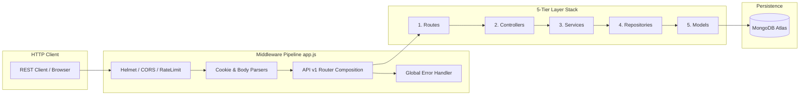
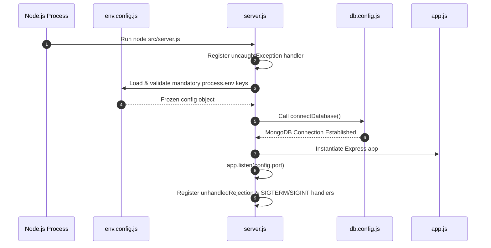

# Backend Platform Engine Specifications

> **Purpose**: Complete technical reference for the Developer OS Express backend platform engine, application bootstrap, 5-tier architecture layers, middleware pipeline, security stack, and error handling architecture.  
> **Document Status**: Active  
> **Audience**: Backend Engineers, System Architects, and API Developers  
> **Last Updated Version**: v0.3.0  
> **Estimated Reading Time**: 6 min read  
> **Related Documents**: [DOC-000 Style Guide](../DOC-000-style-guide.md) | [Documentation Index](../README.md) | [System Architecture Blueprint](../../ARCHITECTURE.md) | [REST API Specs](../api/README.md) | [Identity & Auth Platform](../authentication/README.md)

---

## Navigation
**[← Current vs Future Architecture](../architecture/current-vs-future.md)** | **[Backend Specs](README.md)** | **[Next: Identity Platform →](../authentication/README.md)**

---

## 1. Backend Overview

The Developer OS backend ([`apps/server`](../../apps/server/src/app.js)) is a production-grade Node.js/Express API service. Engineered following a strict **5-tier layered architecture**, it decouples HTTP routing, request parsing, domain business logic, data access abstractions, and database models.



---

## 2. Application Bootstrap Process & Lifecycles

Developer OS strictly separates Express app configuration ([`app.js`](../../apps/server/src/app.js)) from process lifecycle management and network server instantiation ([`server.js`](../../apps/server/src/server.js)).

### `app.js` vs. `server.js` Responsibilities:

| Metric / Boundary | `app.js` (Express App Definition) | `server.js` (Server Listener & Lifecycle) |
| :--- | :--- | :--- |
| **Primary Scope** | Configures Express instance, wires middleware stack, mounts `/api/v1` routes, registers 404 & error handlers. | Boots process, verifies environment variables, connects to MongoDB, starts HTTP server listener, handles system signals. |
| **Network IO** | Contains **zero** port listener logic (`app.listen` is never called in `app.js`). | Manages `app.listen(config.port)` and server shutdown. |
| **Process Control** | Declarative middleware configuration only. | Captures `uncaughtException`, `unhandledRejection`, `SIGTERM`, and `SIGINT`. |
| **Export** | `export default app;` (Used by supertest / integration tests). | Runnable entry point (`node src/server.js`). |

### Bootstrap Execution Sequence:



### Graceful Shutdown Lifecycle:
Upon receiving a `SIGTERM` or `SIGINT` termination signal, `server.js` initiates graceful shutdown:
1. Stops accepting new HTTP connections via `server.close()`.
2. Invokes `disconnectDatabase()` to close active Mongoose connection pools cleanly.
3. Exits process with status code `0`.

---

## 3. Configuration & Native Environment Validation

Environment configuration is managed centrally in [`src/config/env.config.js`](../../apps/server/src/config/env.config.js). On startup, native validation verifies all mandatory keys:

```javascript
// Mandatory environment variables check on process load
const requiredKeys = [
  'NODE_ENV', 'PORT', 'MONGO_URI',
  'JWT_ACCESS_SECRET', 'JWT_ACCESS_EXPIRES_IN',
  'JWT_REFRESH_SECRET', 'JWT_REFRESH_EXPIRES_IN'
];
```

If any mandatory key is missing, `env.config.js` throws an explicit error halting boot immediately. Validated properties are exported as an immutable `Object.freeze(config)` object.

---

## 4. Winston Logger Architecture

System logging is abstracted in [`src/config/logger.js`](../../apps/server/src/config/logger.js) using **Winston**:

- **Environment Awareness**: Logs output as structured JSON in `production` and colorized timestamped text in `development`.
- **Audit Logging**: Dedicated audit logs (`logger.info('[Audit] ...', { userId })`) record operational security events (login, logout, token rotation) without exposing passwords or tokens.

---

## 5. Middleware Pipeline & Security Stack

The Express middleware pipeline in `app.js` processes incoming HTTP requests in strict sequential order:

1. **`helmetMiddleware`**: Configures HTTP security headers (XSS Protection, HSTS, Sniff Prevention).
2. **`corsMiddleware`**: Dynamic domain origin validation matching `config.clientOrigin` with `credentials: true`.
3. **`rateLimiterMiddleware`**: Protects public routes against rate abuse (`express-rate-limit`).
4. **`cookieParser()`**: Parses incoming `Cookie` headers for `httpOnly` refresh tokens.
5. **`express.json()` & `express.urlencoded()`**: Parses JSON and form request payloads (10MB limit).
6. **`apiRouter` (`/api/v1`)**: Route dispatcher for health and auth modules.
7. **`notFoundHandler`**: Catches unmapped paths and passes 404 `ApiError` to next handler.
8. **`globalErrorHandler`**: Centralized error interceptor formatting standardized JSON responses.

---

## 6. Error Handling Strategy & Standard Envelopes

Error handling is fully centralized in [`src/middleware/errorHandler.middleware.js`](../../apps/server/src/middleware/errorHandler.middleware.js):

- **Operational Errors**: Created via `ApiError` class with status codes (`HttpStatus`) and messages (`ResponseMessages`).
- **Database Error Conversion**: Mongoose `CastError` (invalid ObjectId) and duplicate key code `11000` are converted automatically to operational `ApiError` instances.
- **Production Sanitization**: Stack traces are logged internally via Winston but suppressed from JSON HTTP responses when `NODE_ENV=production`.

### Standard Response Format Examples:

```json
// Success Envelope (ApiResponse.success)
{
  "success": true,
  "statusCode": 200,
  "message": "Operation completed successfully.",
  "data": { ... },
  "timestamp": "2026-08-03T00:00:00.000Z"
}

// Error Envelope (ApiResponse.error)
{
  "success": false,
  "statusCode": 401,
  "message": "Invalid email or password.",
  "errors": null,
  "timestamp": "2026-08-03T00:00:00.000Z"
}
```

---

## 7. 5-Tier Backend Folder & Dependency Structure

The backend implementation organizes code into five discrete layers under `apps/server/src/`:

```
apps/server/src/
├── config/             # Environment, Database, Logger & Cookie Configs
├── constants/          # HttpStatus, ResponseMessages, Roles Enums
├── controllers/        # Layer 2: HTTP Parsing & Response Envelopes
├── dtos/               # Data Transfer Objects (UserDTO)
├── middleware/         # Security, Auth, Role, Validation, Error Middlewares
├── models/             # Layer 5: Mongoose Schemas & Database Indexes
├── repositories/       # Layer 4: Database Data Access Abstractions
├── routes/             # Layer 1: Express Routers & Verb Mappings
├── services/           # Layer 3: Pure Business & Domain Logic
└── utils/              # Jwt, Password, ApiError, ApiResponse, AsyncHandler
```

### Unidirectional Dependency Flow Rules:
- `Routes` import `Controllers` and `Middlewares`.
- `Controllers` import `Services`, `ApiResponse`, and `HttpStatus`.
- `Services` import `Repositories`, `UserDTO`, `jwt.util`, and `password.util`.
- `Repositories` import `Models` (Mongoose Schemas).
- **Lower layers (Services, Repositories, Models) MUST NEVER import upper layers (Controllers, Express `req`/`res`).**

---

## 8. Backend Design Principles

1. **Thin Controllers, Fat Services**: Controllers contain zero domain calculations; Services contain 100% of domain business logic.
2. **Pure Services**: Services never interact with Express `req` or `res` objects, ensuring they can be unit-tested without HTTP mocks.
3. **Database Technology Isolation**: Repositories wrap Mongoose queries so data access logic can be updated without touching Services.
4. **No Raw Password Leakage**: User schema enforces `{ select: false }` on password fields; `UserDTO` sanitizes output payloads.

---

## 9. Backend Troubleshooting Guide

| Symptom / Error | Cause | Resolution |
| :--- | :--- | :--- |
| `[Developer OS Config Error] Missing required environment variables` | Missing `.env` file or key on startup. | Copy `.env.example` to `.env` and configure `JWT_ACCESS_SECRET`, `MONGO_URI`, etc. |
| `CORS policy violation: Origin ... is not allowed` | Client domain does not match `CLIENT_ORIGIN`. | Update `CLIENT_ORIGIN` in `.env` to match frontend development URL. |
| `MongoDB connection error` | Invalid MongoDB Atlas connection string or network block. | Verify `MONGO_URI` credentials and MongoDB Atlas IP access whitelist settings. |
| `401 Unauthorized: Invalid or expired token` | Missing or invalid Bearer access token. | Pass valid token in `Authorization: Bearer <token>` header or refresh via `/api/v1/auth/refresh-token`. |

---

## Navigation
**[← Current vs Future Architecture](../architecture/current-vs-future.md)** | **[Backend Specs](README.md)** | **[Next: Identity Platform →](../authentication/README.md)**
