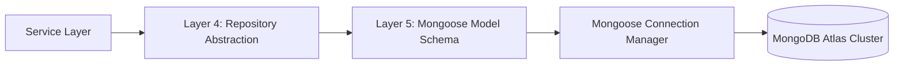

# Database Architecture & Mongoose Schemas

> **Purpose**: Technical specification of Developer OS database architecture, MongoDB Atlas cluster configurations, Mongoose ORM models, indexing rules, and data access standards.  
> **Document Status**: Active  
> **Audience**: Backend Engineers, Database Administrators, and System Architects  
> **Last Updated Version**: v0.3.0  
> **Estimated Reading Time**: 5 min read  
> **Related Documents**: [DOC-000 Style Guide](../DOC-000-style-guide.md) | [Documentation Index](../README.md) | [System Architecture Blueprint](../../ARCHITECTURE.md) | [Identity Platform Specs](../authentication/README.md)

---

## Navigation
**[← API Endpoints Reference](../api/endpoints.md)** | **[Database Specs](README.md)** | **[Next: Design System Specs →](../design-system/README.md)**

---

## 1. Database Overview

Developer OS utilizes **MongoDB Atlas** as its primary document persistence layer, accessed through **Mongoose ORM** (`v8.2.3`). Database access is encapsulated inside Layer 4 (`Repository Layer`), completely isolating database queries from domain services.

---

## 2. Connection Lifecycle & Event Management

Database connection setup is managed in [`src/config/db.config.js`](../../apps/server/src/config/db.config.js):

- **Event Monitoring**: Listens to Mongoose connection lifecycle events (`connected`, `error`, `disconnected`) logging status through the Winston logger.
- **Graceful Shutdown**: Intercepts process termination signals (`SIGTERM`, `SIGINT`) to close connection pools cleanly without losing pending operations.

---

## 3. Active Mongoose Models (v0.3.0)

### User Schema (`User` Collection)

**File**: [`src/models/user.model.js`](../../apps/server/src/models/user.model.js)

| Field | Type | Options & Constraints | Description |
| :--- | :--- | :--- | :--- |
| `_id` | ObjectId | Auto-generated | Primary document key. |
| `name` | String | Required, trim, minlength: 2, maxlength: 50 | User display name. |
| `email` | String | Required, unique, lowercase, trim, indexed | Normalized email address for login. |
| `password` | String | Required, `{ select: false }` | Bcryptjs password hash (cost factor 10). |
| `role` | String | Enum (`Roles.ADMIN`, `Roles.USER`), default: `Roles.USER`, indexed | Role-Based Access Control role claim. |
| `isActive` | Boolean | Default: `true` | Account active state indicator. |
| `refreshTokens` | Array | `[String]` | Array storing SHA-256 hashes of valid refresh tokens. |
| `createdAt` | Date | Auto-managed timestamp | Record creation timestamp. |
| `updatedAt` | Date | Auto-managed timestamp | Record last update timestamp. |

---

## 4. Indexing & Security Strategy

1. **Email Unique Index**: A unique index on `email` prevents race-condition duplicate account registrations.
2. **Role Field Index**: Indexed `role` field optimizes RBAC user queries.
3. **Password Select Option**: Configured with `{ select: false }` to prevent accidental leakage in database queries unless explicitly requested (`.select('+password')`).
4. **SHA-256 Token Digest Storage**: Raw refresh tokens are never persisted; only hex digests created via `hashToken()` are stored.

---

## Navigation
**[← API Endpoints Reference](../api/endpoints.md)** | **[Database Specs](README.md)** | **[Next: Design System Specs →](../design-system/README.md)**
