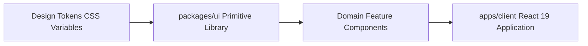

# Developer OS Design System & UI Specifications

> **Purpose**: Technical specification of the Developer OS Design Language, visual color tokens, typography scales, atomic component primitives, and `packages/ui` design package guidelines.  
> **Document Status**: Active  
> **Audience**: Frontend Engineers, UI/UX Designers, and Component Library Maintainers  
> **Last Updated Version**: v0.3.0  
> **Estimated Reading Time**: 4 min read  
> **Related Documents**: [DOC-000 Style Guide](../DOC-000-style-guide.md) | [Documentation Index](../README.md) | [Root README](../../README.md)

---

## Navigation
**[← Database Architecture Specs](../database/README.md)** | **[Design System Specs](README.md)** | **[Next: Sprint Meeting Notes →](../meeting-notes/README.md)**

---

## 1. Design Language & Aesthetics

The **Developer OS Design Language** emphasizes visual hierarchy, sleek dark mode ergonomics, harmonious color palettes, crisp micro-interactions, and high-performance UI rendering.

---

## 2. Color Palette & Token System

Developer OS uses a curated set of color tokens configured as CSS variables in `packages/ui`:

| Token Name | Hex Code | Visual Role | Usage Scenario |
| :--- | :--- | :--- | :--- |
| **Royal Purple** | `#6B46C1` | Primary Brand Accent | Action buttons, primary focus outlines, hero badges |
| **Electric Cyan** | `#00F5FF` | Interactive Highlight | Hover states, glowing accents, active navigation indicators |
| **Dark Obsidian** | `#0F172A` | Background Base | Primary background canvas depth |
| **Slate Dark** | `#1E293B` | Container Card Surface | Elevated card backgrounds, modal dialog surfaces |
| **Muted Slate** | `#64748B` | Secondary Text / Borders | Subtitles, disabled states, subtle border dividers |
| **Bright White** | `#F8FAFC` | High-Contrast Typography | Primary headings, body text, high-contrast labels |

---

## 3. Typography & Component Architecture

- **Primary Font**: Inter / System UI sans-serif stack for maximum readability.
- **Monospace Font**: JetBrains Mono / Fira Code for code blocks, terminal output, and API payloads.
- **Component Primitives (`packages/ui`)**: Atomic UI primitives (Button, Card, Input, Badge, Modal, Spinner) exported as shared React components.

---

## Navigation
**[← Database Architecture Specs](../database/README.md)** | **[Design System Specs](README.md)** | **[Next: Sprint Meeting Notes →](../meeting-notes/README.md)**
