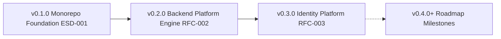

# Developer OS Release Documentation Hub

> **Purpose**: Serves as the central directory index and milestone specification hub for all Developer OS software version releases.  
> **Document Status**: Active  
> **Audience**: Engineers, Architects, DevOps, and Release Managers  
> **Last Updated Version**: v0.3.0  
> **Estimated Reading Time**: 3 min read  
> **Related Documents**: [DOC-000 Style Guide](../DOC-000-style-guide.md) | [Documentation Index](../README.md) | [Root Changelog](../../CHANGELOG.md)

---

## Navigation
**[← Documentation Index](../README.md)** | **[Release Documentation Index](README.md)** | **[Next: Release v0.1.0 →](v0.1.0-monorepo-foundation.md)**

---

## 1. Release Governance & Versioning Strategy

Developer OS strictly adheres to [Semantic Versioning (SemVer 2.0.0)](https://semver.org/):
- **MAJOR (`X.0.0`)**: Incompatible API or architectural breaking changes.
- **MINOR (`0.Y.0`)**: Backwards-compatible milestone releases and new RFC features.
- **PATCH (`0.0.Z`)**: Backwards-compatible bug fixes and security hotfixes.

### Release Process & RFC Association:
Every release corresponds to a completed **RFC (Request for Comments)** or **ESD (Engineering Spec Document)**. While [CHANGELOG.md](../../CHANGELOG.md) maintains the high-level chronological changelog, this directory provides the in-depth architectural and technical release specifications for each version tag.

---

## 2. Release History & Version Tag Matrix

| Version Tag | Release Name | RFC Milestone | Primary Deliverables | Release Note Document |
| :--- | :--- | :--- | :--- | :--- |
| **`v0.1.0`** | Monorepo Foundation | ESD-001 | `pnpm` workspaces, shared packages (`shared`, `ui`), linting & tooling | [v0.1.0 Release Specs](v0.1.0-monorepo-foundation.md) |
| **`v0.2.0`** | Backend Platform Engine | RFC-002 | Express 5-tier pattern, Winston logger, security stack, health check API | [v0.2.0 Release Specs](v0.2.0-backend-platform.md) |
| **`v0.3.0`** | Identity Platform Foundation | RFC-003 | User model, dual JWT tokens, `bcryptjs`, SHA-256 token hashing, RBAC, UserDTO | [v0.3.0 Release Specs](v0.3.0-identity-platform.md) |

---

## 3. Release Timeline Flow

---

## Navigation
**[← Documentation Index](../README.md)** | **[Release Documentation Index](README.md)** | **[Next: Release v0.1.0 →](v0.1.0-monorepo-foundation.md)**
