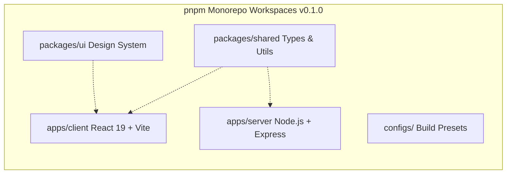

# Developer OS Release Notes — v0.1.0

> **Purpose**: Technical milestone specification for release tag `v0.1.0` (Monorepo Foundation & Tooling).  
> **Document Status**: Active  
> **Audience**: Engineers, Architects, and DevOps  
> **Last Updated Version**: v0.3.0  
> **Estimated Reading Time**: 4 min read  
> **Related Documents**: [Release Index](README.md) | [System Architecture Blueprint](../../ARCHITECTURE.md) | [DOC-000 Style Guide](../DOC-000-style-guide.md)

---

## Navigation
**[← Release Index](README.md)** | **[Release v0.1.0 Specs](v0.1.0-monorepo-foundation.md)** | **[Next: Release v0.2.0 →](v0.2.0-backend-platform.md)**

---

## 1. Overview

Release **`v0.1.0`** established the core monorepo workspace infrastructure for **Developer OS (Brand: Sagar.dev)**. It initialized package isolation, cross-boundary workspace dependency links, static code analysis tooling, and repository governance presets.

- **Git Tag**: `v0.1.0`
- **Related Spec**: Engineering Spec Document `ESD-001`
- **Release Date**: August 2026

---

## 2. Milestone Objectives

1. Establish a high-performance monorepo workspace using `pnpm`.
2. Decouple React frontend applications from Node.js backend API services.
3. Create shared packages (`packages/shared` and `packages/ui`) to prevent code duplication.
4. Enforce workspace-wide code formatting and static linting rules.

---

## 3. Features & Infrastructure Delivered

- **Monorepo Layout**: Created `apps/client`, `apps/server`, `packages/shared`, `packages/ui`, and `configs/`.
- **Package Linking**: Configured `@developer-os/shared` and `@developer-os/ui` as workspace dependencies (`workspace:*`).
- **Code Quality Tooling**: Configured ESLint (`eslint.config.js`), Prettier (`.prettierrc`), and EditorConfig (`.editorconfig`).
- **GitHub Governance**: Published `.github/CODE_OF_CONDUCT.md`, `.github/PULL_REQUEST_TEMPLATE.md`, and issue template configs.

---

## 4. Architecture Impact

- Enforced strict package boundary separation between client UI components and backend server layers.
- Shared models and TypeScript interfaces in `packages/shared` established the foundation for single-source-of-truth contracts.

---

## 5. Breaking Changes & Migration Notes

- **Breaking Changes**: None (Initial release).
- **Migration Notes**: Fresh environment setup requires running `pnpm install` at the monorepo root.

---

## 6. Future Follow-up Work

- Implement the Express backend platform foundation (`RFC-002` / `v0.2.0`).
- Implement the Identity Platform foundation (`RFC-003` / `v0.3.0`).

---

## Navigation
**[← Release Index](README.md)** | **[Release v0.1.0 Specs](v0.1.0-monorepo-foundation.md)** | **[Next: Release v0.2.0 →](v0.2.0-backend-platform.md)**
