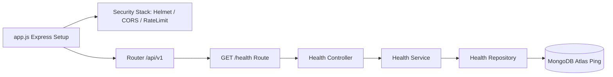

# Developer OS Release Notes — v0.2.0

> **Purpose**: Technical milestone specification for release tag `v0.2.0` (Backend Platform Engine Foundation).  
> **Document Status**: Active  
> **Audience**: Backend Engineers, Architects, and DevOps  
> **Last Updated Version**: v0.3.0  
> **Estimated Reading Time**: 5 min read  
> **Related Documents**: [Release Index](README.md) | [Backend Engine Specs](../backend/README.md) | [System Architecture Blueprint](../../ARCHITECTURE.md)

---

## Navigation
**[← Release v0.1.0](v0.1.0-monorepo-foundation.md)** | **[Release v0.2.0 Specs](v0.2.0-backend-platform.md)** | **[Next: Release v0.3.0 →](v0.3.0-identity-platform.md)**

---

## 1. Overview

Release **`v0.2.0`** delivered the production-grade backend platform foundation for **Developer OS (Brand: Sagar.dev)**. It established Express app/server separation, native environment variable validation, a Winston structured logging abstraction, security middleware, global centralized error handling, and the 5-tier layered architecture.

- **Git Tag**: `v0.2.0`
- **Related Spec**: Request for Comments `RFC-002: Backend Platform Foundation`
- **Release Date**: August 2026

---

## 2. Milestone Objectives

1. Establish Express application setup with clean `app.js` and `server.js` separation.
2. Enforce the 5-tier layered architecture (`Route` → `Controller` → `Service` → `Repository` → `Database`).
3. Build native boot-time environment variable validation without third-party schema libraries.
4. Implement a Winston logger abstraction and global error handling middleware with standard JSON envelopes.
5. Deploy a 5-tier health diagnostics endpoint (`GET /api/v1/health`).

---

## 3. Features & Infrastructure Delivered

- **App / Server Decoupling**: [`src/app.js`](../../apps/server/src/app.js) handles middleware & routing; [`src/server.js`](../../apps/server/src/server.js) handles DB initialization, listener, and `SIGTERM`/`SIGINT` graceful shutdown.
- **Environment Configuration**: Boot-time fail-fast verification in [`src/config/env.config.js`](../../apps/server/src/config/env.config.js).
- **Structured Winston Logger**: Configured [`src/config/logger.js`](../../apps/server/src/config/logger.js) supporting colorized console dev logs and JSON production logs.
- **Security Middleware Stack**: Integrated `helmet`, dynamic origin matching `cors`, and `express-rate-limit`.
- **Centralized Error Handling**: Built [`src/middleware/errorHandler.middleware.js`](../../apps/server/src/middleware/errorHandler.middleware.js) using `ApiError` and `ApiResponse` envelope generators.
- **5-Tier Health Check Endpoint**: Implemented `GET /api/v1/health` testing uptime, memory usage, and MongoDB database ping.

---

## 4. Architecture Impact

- Established the strict 5-tier backend execution pattern (`Route` → `Controller` → `Service` → `Repository` → `Database`).
- Standardized API JSON output structures (`ApiResponse.success` / `ApiResponse.error`).
- Enforced zero leak of Express HTTP `req`/`res` objects into Services or Repositories.

---

## 5. Breaking Changes & Migration Notes

- **Breaking Changes**: Refactored existing top-level `/health` route to comply with 5-tier architecture under `/api/v1/health`.
- **Migration Notes**: Server startup requires mandatory `.env` keys (`NODE_ENV`, `PORT`, `MONGO_URI`).

---

## 6. Future Follow-up Work

- Implement the Identity Platform & Authentication foundation (`RFC-003` / `v0.3.0`).

---

## Navigation
**[← Release v0.1.0](v0.1.0-monorepo-foundation.md)** | **[Release v0.2.0 Specs](v0.2.0-backend-platform.md)** | **[Next: Release v0.3.0 →](v0.3.0-identity-platform.md)**
